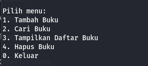

# List Buku - Array Multidimensional

---

## Deskripsi
List Buku adalah judul proyek untuk tugas kuliah yang bertujuan untuk mengimplementasikan konsep-konsep ilmu Array Multidimensional menggunakan bahasa pemrograman Python.

## Penggunaan
1. Klik button <strong>Code</strong> untuk Download repositori 

    - <b>Catatan, pastikan git sudah terinstall di komputer Anda.</b> 
    Jika menggunakan git salin : `git clone https://github.com/zidan-herlangga/list-buku.git`

    atau

    - Jika tidak menggunakan pilih `Download ZIP`

2. Jalankan script utama dengan perintah: `python main.py`

3. Ikuti petunjuk yang diberikan dalam aplikasi untuk menggunakan menu yang tersedia.

## Menu Program

## Kontribusi
- Zidan Herlangga 
- Gusiar Ilham
- Naufal Ralfi
- Novan Risqi
- Maulana Wiksa

## Noted
Folder dengan nama Testing bertujuan untuk update yang akan datang

Untuk update repository bisa melakukan perintah di terminal: `git pull`